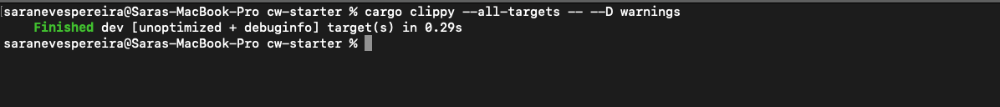
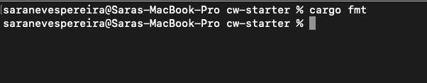
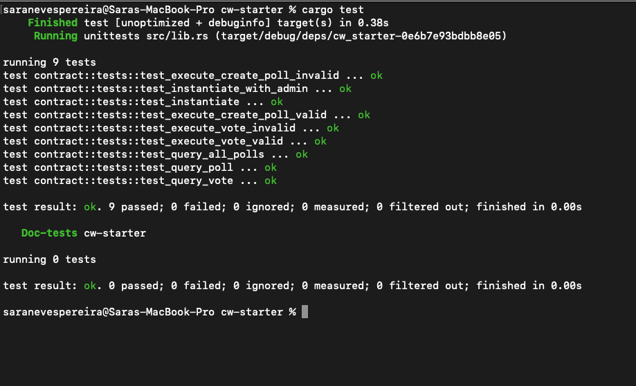
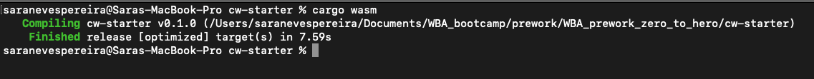
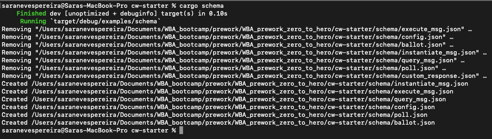

# WBA_prework_zero_to_hero

## Commands

As suggested by the tutorial, I ran all the commands after finishing and made sure there were no warnings.

#### cargo clippy --all-targets -- --D warnings

#### cargo fmt

#### cargo test

#### cargo wasm

#### cargo schema

